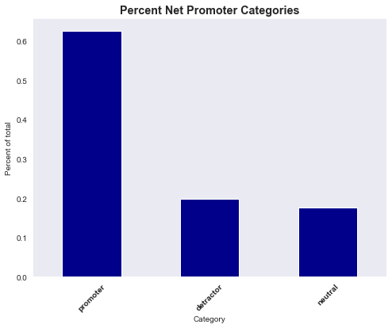
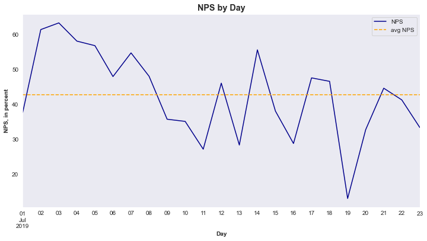
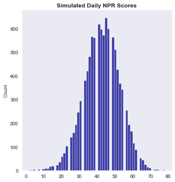
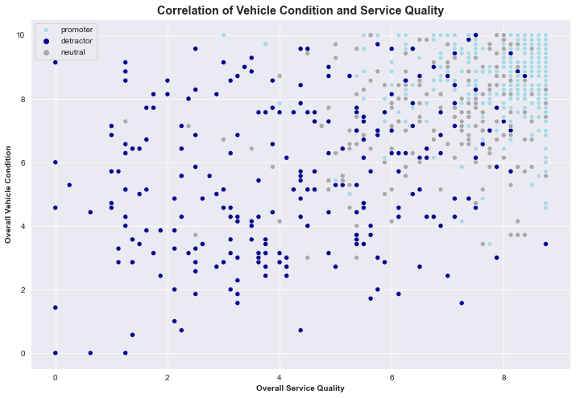
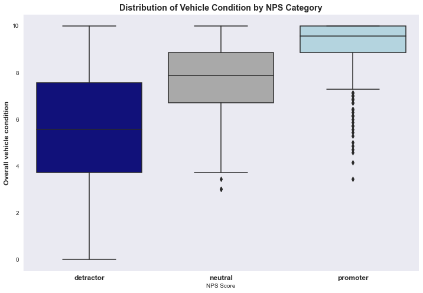
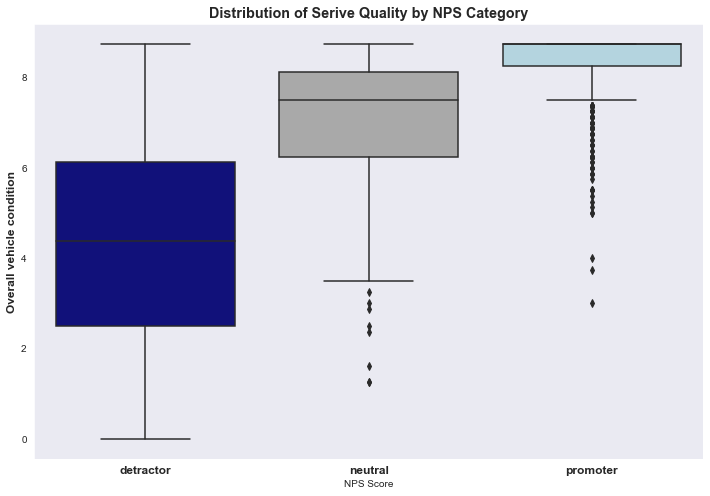
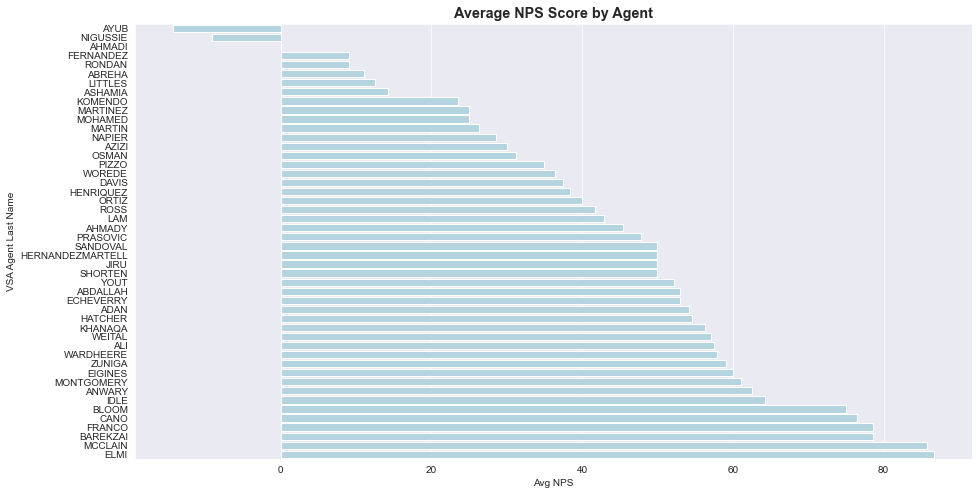
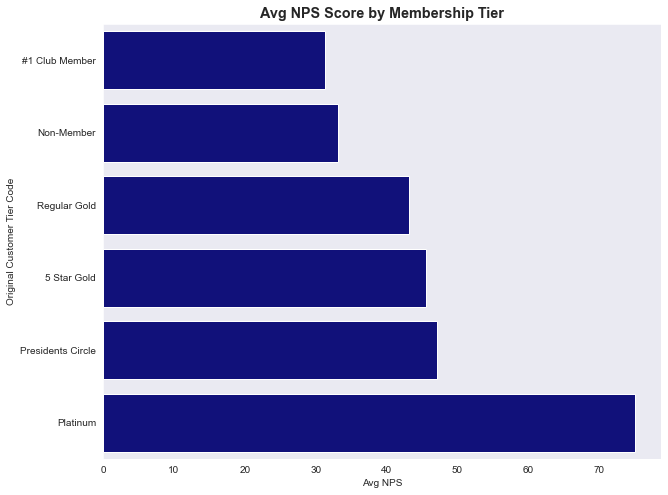
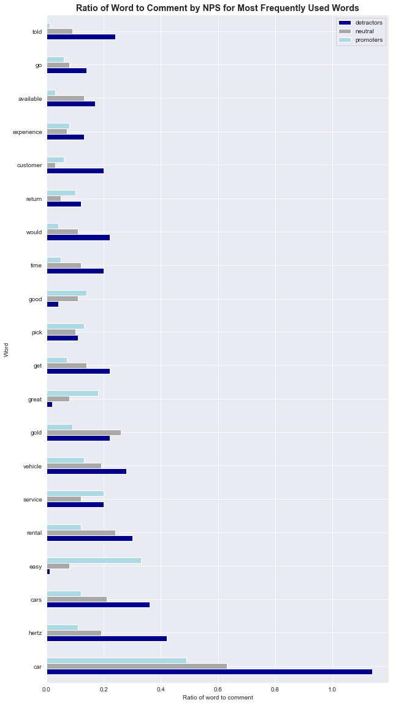

# Analyzing Customer Survey Data From Hertz 


## The Data

The data consist of 1,489 observations containing 48 features from a survey given to customers that returned a rental car to Hertz at the Phoenix Airport. The survey data were collect from 7/1/2019 to 7/23/2019. There is no information provided about the customers that used Hertz over the same time period and did not complete the survey, so it is not possible to determine if this is a representative sample.

## Net Promoter Score

One of the questions on the survey is, "How likely are you to recommend Hertz to a friend or family member?" with a ten-point scale. Customers are placed in the following categories based on their response:

- **Promoters**: 9 or 10 on the recommendation scale and are assigned a value of 100
- **Neutral**: 7 or 8 on the recommendation scale and are assigned a value of 0
- **Detractors**: <= 6 on the recommendation scale and are assigned a value of -100



In order to get the Net Promoter Score, the percent of detractors is subtracted from the percent of promoters.


## Change in Net Promoter Score Over Time

The average Net Promoter Score(NPS) can be used as a Key Performance Indicator(KPI) to monitor overall customer satisfaction. 



**The overall NPS for this 23-day window was 42.78%.**

There is quite a bit of daily variation in the score and it looks like there may even be a negative trend, although the time period is really too short to find trends or seasonality. 

In order to determine if this amount of variation and sample mean is to be expected, a bootstrap sampling technique was used to simulate the NPS scores for 10,000 days.



We are 95% confident that the true NPS mean lies between 42.55 and 42.95.

**The overall NPS from the 23 days of recorded survey data had a mean score of 42.78, which is within the 95% confidence interval.**

**Using Standard Deviations**
- 68% of the daily NPS values lie between 32.76 and 52.74.
- 95% of the daily NPS values lie between 22.78 and 62.72.
- 99.7% of the daily NPS values lie between 12.79 and 72.71.

This shows that while the recorded data held some relatively low (13) and high (63) values, they are still within 3 standard deviations of the mean and therefore, are not extreme scores.

Because of this daily fluctuation, if NPS is going to be used as a KPI, it is recommended that a rolling average of a minimum of 7 days be used to smooth out this random variability.


## Factors Impacting Net Promoter Score

The survey contained several questions about the quality and condition of the vehicle as well as questions that addressed the quality of the service. These were combined into two aggregate columns: Overall Vehicle Condition and Overall Service Quality. 



As expected, higher reported service quality and vehicle conditions are associated with higher NPS values. Of note, there are outliers in each cluster. Ideally, objective measures of vehicle condition (ex. age) and service (ex. time on hold) would be included. 





Although these distributions are similar, it is interesting that there is very little overlap in the boxes for service quality. **This suggests that perceived service quality may be a more important factor than vehicle quality for customer satisfaction.** 

The agent that a customer worked with seems to have an impact on NPS. The following agents served more than 6 customers that returned a survey in the 23-day window.



There is also a relationship between customer membership type and NPS. 



\#1 Club Members are less satisfied than non-members. Perhaps this is an issue of expectations - the members expect a different level of service than they are receiving. The company seems to be doing well at keeping the Platinum members satisfied.

## Customer Comments

The survey had an opportunity for customers to add a text response after the recommendation question. A total of 1,076 people submitted a response, divided as following: 

- Detractor    282
- Neutral      194
- Promoters    600

This data was stripped of punctuation and stop words and then tokenized before creating a frequency dictionary of the word usage. The graph below shows the 20 most frequently used words and how they differ by NPS category.





## Future Work

- Perform more textual analysis on the comment data, including comments captured in other sections to look for common areas of strengths and weaknesses. 

- Analyze what distinguishes the Neutral Customers from the Promoters to see if there are opportunities there. 

- Look into the outliers - the customers that reported a negative experience and yet highly recommend Hertz and the ones that reported a positive experience and yet would not recommend the company. Are there any insight here?

- Track the NPS over time to look for seasonality or trends. Are there particular times when it is higher or lower?

- Use the survey data to deliver actionable recommendations for Hertz in order to improve their customer experience. 


```python

```
